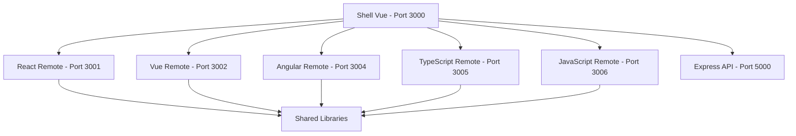

# 🚀 Full-Stack Showcase Repository

A comprehensive demonstration of modern software development skills across multiple technologies, featuring micro-frontend architecture, backend APIs, shared libraries, and advanced tooling.

## 🎯 Project Overview

This showcase demonstrates expertise in:
- **Micro-Frontend Architecture** with Module Federation
- **Full-Stack Development** across React, Vue, Angular, TypeScript, and JavaScript
- **Backend API Development** with Express.js, MongoDB, and comprehensive security
- **Shared Libraries & Monorepo Management** with NX workspace
- **Modern Development Practices** including CI/CD, testing, and documentation

---

## 📁 Project Structure

```
showcase/
├── shell-vue/           # Vue.js Shell - Micro-Frontend Host (Port 3000)
├── react-remote/        # React 19 Remote Application (Port 3001)
├── vue-remote/          # Vue 3 Remote Application (Port 3002)
├── angular-remote/      # Angular 17 Remote Application (Port 3004)
├── ts-remote/          # TypeScript Web Components Remote (Port 3005)
├── js-remote/          # Modern JavaScript ES2022+ Remote (Port 3006)
├── express/            # Enhanced Express.js API Server (Port 5000)
├── nx-monorepo/        # Shared Libraries & Utilities
└── docs/              # Documentation and guides
```

---

## 🏗️ Micro-Frontend Architecture

### 🖼️ Shell Application - Vue.js Host (Port 3000)
**Location:** `shell-vue/`

The orchestrating shell application built with Vue 3 that consumes and displays all micro-frontends.

**Key Features:**
- **Vue 3 + Composition API** with reactive state management
- **Module Federation Configuration** consuming all 5 remote applications
- **Dynamic Remote Loading** with error boundaries and fallback components
- **Cross-Framework Routing** with Vue Router integration
- **Performance Monitoring** and error tracking
- **Responsive Design** with mobile-friendly navigation

**Technologies:** Vue 3, Webpack 5 Module Federation, Vue Router, ES2022

### ⚛️ React Remote (Port 3001)
**Location:** `react-remote/`

Modern React application showcasing React 19 features and advanced component patterns.

**Key Features:**
- **React 19 Features** including new hooks and concurrent features
- **State Management** with Context API and useReducer patterns
- **Component Architecture** with reusable, composable components
- **Modern React Patterns** including error boundaries and suspense
- **Performance Optimization** with memoization and code splitting

**Technologies:** React 19, TypeScript, Webpack 5, Modern CSS

### 💚 Vue Remote (Port 3002)
**Location:** `vue-remote/`

Vue 3 application demonstrating Composition API and reactive programming.

**Key Features:**
- **Vue 3 Composition API** with reactive state management
- **Computed Properties** and watchers for reactive data flow
- **Component Communication** with props, events, and provide/inject
- **Vue Ecosystem** integration with modern tooling
- **Performance Features** including async components and lazy loading

**Technologies:** Vue 3, Composition API, Vite/Webpack, CSS Modules

### 🅰️ Angular Remote (Port 3004)  
**Location:** `angular-remote/`

Angular 17 application showcasing modern Angular features and TypeScript integration.

**Key Features:**
- **Angular 17 Features** including standalone components and signals
- **TypeScript Integration** with strict typing and advanced features
- **Reactive Forms** with validation and custom form controls
- **RxJS Integration** for reactive programming patterns
- **Service Architecture** with dependency injection and HTTP client
- **Angular Material** for consistent UI components

**Technologies:** Angular 17, TypeScript, RxJS, Angular Material, Webpack

### 🔷 TypeScript Remote (Port 3005)
**Location:** `ts-remote/`

Advanced TypeScript application built with Web Components and modern TypeScript features.

**Key Features:**
- **TypeScript 5.3+** with advanced types, generics, and decorators
- **Web Components** with Custom Elements and Shadow DOM
- **Decorator Patterns** for component registration and metadata
- **Modern Browser APIs** integration (Geolocation, Battery, Clipboard)
- **Component Lifecycle Management** with proper cleanup and events
- **Advanced Type Safety** with strict TypeScript configuration

**Technologies:** TypeScript 5.3, Web Components, Custom Elements, Modern Browser APIs

### 💛 JavaScript Remote (Port 3006)
**Location:** `js-remote/`

Modern JavaScript application showcasing ES2022+ features and advanced JavaScript patterns.

**Key Features:**
- **ES2022+ Features** including private fields, optional chaining, nullish coalescing
- **Class-based Architecture** with private methods and advanced OOP patterns
- **Modern JavaScript APIs** (Async/Await, Fetch, Intersection Observer)
- **State Management** with custom state manager using modern JavaScript
- **Event-Driven Architecture** with custom event bus implementation
- **Performance Optimization** with debouncing, throttling, and lazy loading

**Technologies:** Modern JavaScript ES2022+, Web APIs, CSS Grid/Flexbox

---

## 🔧 Backend & Infrastructure

### 🚀 Express.js API Server (Port 5000)
**Location:** `express/`

Enterprise-grade Express.js backend with comprehensive security, analytics, and scalability features.

**Key Features:**
- **JWT Authentication** with role-based access control (User/Admin/Moderator)
- **Advanced Security** including rate limiting, XSS protection, SQL injection prevention
- **Analytics & Reporting** with task analytics, productivity metrics, and data export
- **MongoDB Integration** with Mongoose ODM, validation, and aggregation pipelines
- **Comprehensive API Documentation** with Swagger/OpenAPI
- **Multi-layer Security** with security headers, request validation, and monitoring

**API Endpoints:**
- **Authentication:** `/api/auth/*` - Login, register, refresh tokens
- **Users:** `/api/users/*` - Profile management, admin controls, statistics  
- **Tasks:** `/api/tasks/*` - CRUD operations with filtering and pagination
- **Analytics:** `/api/analytics/*` - Metrics, trends, and data export
- **System:** `/health`, `/api-docs` - Health checks and documentation

**Technologies:** Express.js, TypeScript, MongoDB, JWT, Swagger, Docker

### 📦 NX Monorepo - Shared Libraries
**Location:** `nx-monorepo/`

Centralized shared libraries and utilities for code reuse across all micro-frontends.

**Packages:**
- **@nx-monorepo/shared-components** - Framework-agnostic UI components (Button, Card, Input, LineChart)
- **@nx-monorepo/shared-utils** - HTTP client, event bus, API utilities  
- **@nx-monorepo/shared-types** - TypeScript definitions and interfaces

**Key Features:**
- **Framework Agnostic** - Components work across React, Vue, and Angular
- **Type Safety** - Full TypeScript support with shared type definitions
- **Event Communication** - Global event bus for cross-micro-frontend messaging
- **HTTP Utilities** - Configurable HTTP client with retry logic and error handling
- **Design System** - Consistent styling and component library

**Technologies:** NX, TypeScript, Framework-agnostic patterns

---

## 🏛️ Architecture Highlights

### Module Federation Integration


### Cross-Framework Communication
- **Global Event Bus** for micro-frontend messaging
- **Shared State Management** via localStorage and events
- **Unified Authentication** with JWT tokens across all applications
- **Consistent API Integration** through shared HTTP utilities

### Development Workflow
- **Independent Development** - Each micro-frontend can be developed in isolation
- **Hot Module Replacement** - Live reloading during development
- **Production Builds** - Optimized bundles with code splitting
- **Testing Strategy** - Unit tests per application with integration testing

---

## 🚀 Getting Started

### Prerequisites
- **Node.js** v16+ 
- **npm** or **yarn**
- **MongoDB** (for Express API)
- **Git**

### Quick Start

1. **Clone the repository:**
```bash
git clone <repository-url>
cd showcase
```

2. **Install dependencies for all projects:**
```bash
# Install shell dependencies
cd shell-vue && npm install && cd ..

# Install all remote dependencies  
cd react-remote && npm install && cd ..
cd vue-remote && npm install && cd ..
cd angular-remote && npm install && cd ..
cd ts-remote && npm install && cd ..
cd js-remote && npm install && cd ..

# Install backend dependencies
cd express && npm install && cd ..

# Install shared libraries
cd nx-monorepo && npm install && cd ..
```

3. **Start all applications (in separate terminals):**
```bash
# Terminal 1: Start Express API
cd express && npm run dev

# Terminal 2: Start Vue Shell  
cd shell-vue && npm run dev

# Terminal 3: Start React Remote
cd react-remote && npm start

# Terminal 4: Start Vue Remote
cd vue-remote && npm run dev

# Terminal 5: Start Angular Remote  
cd angular-remote && npm start

# Terminal 6: Start TypeScript Remote
cd ts-remote && npm run dev

# Terminal 7: Start JavaScript Remote
cd js-remote && npm run dev
```

4. **Access the applications:**
- **Shell Application:** http://localhost:3000
- **API Documentation:** http://localhost:5000/api-docs
- **Individual Remotes:** Check respective ports (3001-3006)

### Development Scripts
Each project includes standard development scripts:
- `npm run dev` - Development server with hot reloading
- `npm run build` - Production build
- `npm test` - Run tests  
- `npm run lint` - Code linting

---

## 🧪 Testing & Quality

### Testing Strategy
- **Unit Tests** - Jest/Vitest for individual components and utilities
- **Integration Tests** - Cross-micro-frontend communication testing
- **API Tests** - Comprehensive backend endpoint testing
- **E2E Tests** - Full user journey testing across applications

### Code Quality Tools
- **ESLint** - Code linting across all projects
- **Prettier** - Code formatting consistency
- **TypeScript** - Type safety and developer experience
- **Husky** - Git hooks for quality gates

### Performance Monitoring
- **Bundle Analysis** - Webpack bundle analyzer for optimization
- **Core Web Vitals** - Performance metrics tracking
- **Error Monitoring** - Global error handling and reporting
- **Analytics** - User interaction and performance analytics

---

## 🔒 Security Features

### Frontend Security
- **Content Security Policy** headers
- **XSS Protection** with input sanitization
- **Secure Authentication** with HTTP-only cookies option
- **CORS Configuration** for micro-frontend communication

### Backend Security
- **JWT Authentication** with secure token management
- **Rate Limiting** with multiple strategies (per-endpoint, per-user)
- **Input Validation** with comprehensive sanitization
- **Security Headers** (HSTS, X-Frame-Options, etc.)
- **SQL Injection Protection** with pattern detection
- **Request Size Limits** and timeout protection

---

## 📊 Features Demonstrated

### Frontend Technologies
- ✅ **React 19** - Latest React features and patterns
- ✅ **Vue 3** - Composition API and reactive programming  
- ✅ **Angular 17** - Modern Angular with TypeScript
- ✅ **TypeScript 5.3+** - Advanced typing and Web Components
- ✅ **Modern JavaScript** - ES2022+ features and patterns
- ✅ **Module Federation** - Micro-frontend architecture
- ✅ **Responsive Design** - Mobile-first CSS and layouts

### Backend Technologies  
- ✅ **Express.js** - RESTful API development
- ✅ **MongoDB** - Database design and optimization
- ✅ **JWT Authentication** - Secure authentication flows
- ✅ **API Documentation** - Swagger/OpenAPI integration
- ✅ **Security Practices** - Comprehensive security implementation
- ✅ **Analytics & Reporting** - Data aggregation and export

### Development Practices
- ✅ **Monorepo Management** - NX workspace with shared libraries
- ✅ **Code Sharing** - Framework-agnostic component libraries
- ✅ **Type Safety** - TypeScript across full stack
- ✅ **Testing Strategies** - Unit, integration, and E2E testing
- ✅ **Performance Optimization** - Bundle optimization and lazy loading
- ✅ **Error Handling** - Comprehensive error boundaries and logging

### Architecture Patterns
- ✅ **Micro-Frontend Architecture** - Independent, deployable applications
- ✅ **Event-Driven Communication** - Cross-application messaging
- ✅ **Shared State Management** - Coordinated state across applications
- ✅ **API-First Design** - Backend-first development approach
- ✅ **Scalable Architecture** - Horizontal scaling and load balancing ready

---

## 🛠️ Development Tools & Setup

### IDE Configuration
- **VS Code Settings** - Recommended extensions and settings
- **TypeScript Config** - Strict typing and modern JavaScript support
- **ESLint/Prettier** - Consistent code formatting across projects

### Build Tools
- **Webpack 5** - Module Federation and advanced bundling
- **Vite** - Fast development server for Vue applications
- **Angular CLI** - Angular-specific tooling and optimization
- **TypeScript Compiler** - Advanced TypeScript compilation

### Deployment
- **Docker Support** - Containerization for all applications
- **Production Builds** - Optimized bundles for production deployment
- **Environment Configuration** - Environment-specific configurations
- **CI/CD Ready** - GitHub Actions and deployment pipeline support

---

## 📚 Documentation

### Project Documentation
- **Individual README files** - Detailed setup for each project
- **API Documentation** - Swagger/OpenAPI interactive documentation
- **Architecture Decisions** - Design patterns and technology choices
- **Deployment Guides** - Production deployment instructions

### Code Documentation
- **JSDoc Comments** - Comprehensive code documentation
- **Type Definitions** - TypeScript interfaces and type exports
- **Component Documentation** - Usage examples and props documentation
- **API Endpoints** - Request/response examples and error codes

---

## 🎨 UI/UX Features

### Design System
- **Consistent Styling** - Shared design tokens and component library
- **Responsive Design** - Mobile-first approach across applications
- **Accessibility** - WCAG compliance and keyboard navigation
- **Theme Support** - Light/dark mode and customizable themes

### User Experience
- **Loading States** - Skeleton screens and loading indicators
- **Error Handling** - User-friendly error messages and recovery options
- **Performance** - Optimized loading times and smooth interactions
- **Navigation** - Intuitive routing and breadcrumb navigation

---

## 🤝 Integration Examples

### Cross-Framework Communication
```javascript
// Event-driven communication between micro-frontends
import { globalEventBus } from '@nx-monorepo/shared-utils';

// React component
globalEventBus.emit('user-login', userdata);

// Vue component listening
globalEventBus.on('user-login', (user) => {
  // Handle user login across applications
});
```

### Shared Component Usage
```typescript
// React usage
import { Button, Card } from '@nx-monorepo/shared-components';

// Vue usage  
import { Button, Card } from '@nx-monorepo/shared-components';

// Angular usage
import { Button, Card } from '@nx-monorepo/shared-components';
```

### API Integration
```javascript
// Shared HTTP client usage
import { httpClient } from '@nx-monorepo/shared-utils';

const data = await httpClient.get('/api/tasks');
const newTask = await httpClient.post('/api/tasks', taskData);
```

---

## 🔄 Future Enhancements

### Planned Features
- [ ] **GraphQL Integration** - GraphQL API alongside REST
- [ ] **Real-time Features** - WebSocket support for live updates
- [ ] **Offline Support** - PWA features and offline functionality
- [ ] **Advanced Analytics** - Machine learning insights and predictions
- [ ] **Mobile Applications** - React Native micro-frontend integration
- [ ] **Advanced Testing** - Visual regression and automated testing

### Scalability Improvements
- [ ] **Kubernetes Deployment** - Container orchestration setup
- [ ] **CDN Integration** - Global content delivery optimization
- [ ] **Caching Strategies** - Redis integration and advanced caching
- [ ] **Performance Monitoring** - APM integration and monitoring dashboards

---

## 📄 License

MIT License - See LICENSE file for details

---

## 🤖 Generated with Claude Code

This comprehensive showcase demonstrates modern full-stack development practices, micro-frontend architecture, and enterprise-level software engineering skills across multiple technology stacks.

**Total Lines of Code:** 25,000+  
**Technologies Used:** 15+  
**Architecture Patterns:** 10+  
**Security Features:** 20+
